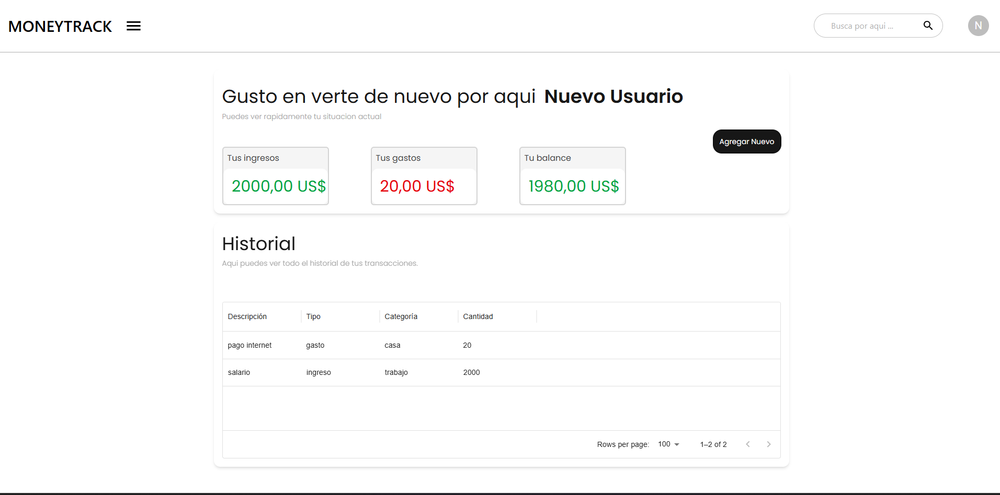
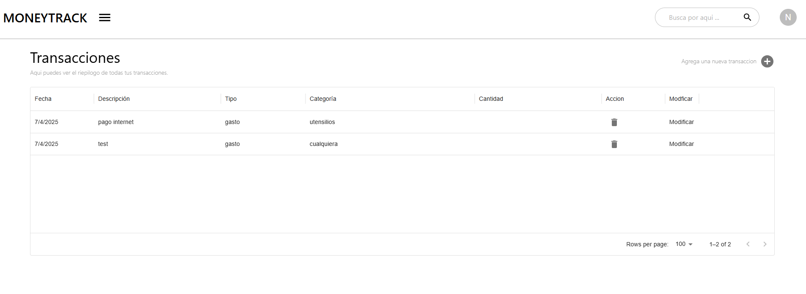
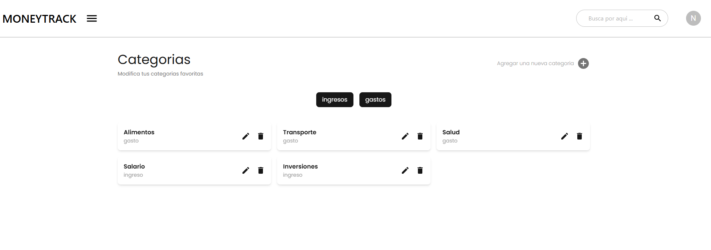

# MoneyTrack

MoneyTrack es una aplicación para gestionar tus finanzas personales. Permite registrar ingresos, gastos, y visualizar un resumen financiero de manera sencilla y atractiva.

## Características

- **Gestión de ingresos y gastos**: Registra tus transacciones fácilmente.
- **Resumen financiero**: Visualiza tus ingresos, gastos y balance actual.
- **seguridad robusta**: autenticacion con jwt, contraseñas encriptadas, rutas protegidas
- **Experiencia de usuario**: diseño responsivo
- **Interfaz moderna**: Diseñada con React, Tailwind y Material-UI para una experiencia de usuario fluida.
- **Backend robusto**: Construido con Node.js y MongoDB.

## Capturas de Pantalla

### Dashboard


### Historial de Transacciones


### Categorias del usuario


## Tecnologías Utilizadas

- **Frontend**: React, Material-UI, react router
- **Backend**: Node.js, Express.js, axios
- **Base de Datos**: MongoDB, mongoose
- **Autenticación**: JSON Web Tokens (JWT), bcrypt, dotenv

## Proceso de Construcción
- **Investigacion Inicial**: Análisis de requerimientos, Definición de stack tecnológico

- **Implementación backend**:
Configuración del servidor Express,
Modelado de datos con Mongoose,
Implementación de autenticación JWT,
Creación de API RESTful

- **Desarrollo frontend**:
Configuración de React, Implementación de rutas protegidas, Conexión con backend mediante Axios

## Instalación

1. Clona el repositorio:
   ```bash
   git clone https://github.com/tu-usuario/moneytrack.git
   cd moneytrack

   
2. Instala las dependencias del servidor:
    ```bash 
    cd server
    npm install

3. Instala las dependencias del cliente:
     ```bash 
     cd ../client
    npm install

4. Configura las variables de entorno:
Crea un archivo .env en la carpeta server con las siguientes variables:
    ```bash 
    tuMONGO_URI=<_uri_de_mongodb>
    JWT_SECRET=<tu_secreto_jwt>

5. Inicia el servidor y el cliente:
   ```bash 
   cd server
    npm start
    cd ../client
    npm start

## Conclucion y proximas mejoras

Este proyecto es una aplicación web desarrollada con el objetivo de interiorizar y fortalecer habilidades adquiridas en el desarrollo frontend y backend, con un enfoque en seguridad y organización.

 He implementado principios SOLID, encriptación de datos con bcrypt, autenticación mediante JWT en localStorage, y conexión con una API utilizando Axios. Además, se siguió el método ágil de desarrollo de manera autónoma.

- Próximos Desafíos y Mejoras 🚀

    - Filtrar transacciones por categorías 🔎

         1. Implementar un filtro en la UI que permita a los usuarios buscar transacciones por categorías específicas.

        2. Optimizar las consultas en el backend para obtener solo las transacciones que pertenecen a una categoría seleccionada.


    - Agregar gráficos 📊

        1. Implementar visualizaciones con librerías como Chart.js o D3.js para representar los datos de las transacciones.

        2. Crear gráficos de barras y circulares que reflejen el gasto por categoría y por período de tiempo.


    - Diseño más llamativo y elegante 🎨

        1. Refinar la paleta de colores y tipografías para mejorar la estética y la legibilidad de la interfaz.


        2. Optimizar el diseño responsivo para que la aplicación funcione perfectamente en dispositivos móviles y de escritorio.

        3. Implementar un sistema de temas (modo claro/oscuro) para mayor personalización.